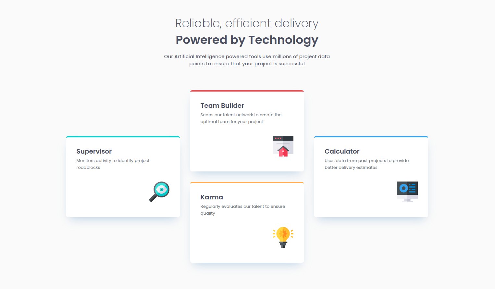

# Frontend Mentor - Four card feature section solution

This is a solution to the [Four card feature section challenge on Frontend Mentor](https://www.frontendmentor.io/challenges/four-card-feature-section-weK1eFYK). Frontend Mentor challenges help you improve your coding skills by building realistic projects.

## Table of contents

- [Frontend Mentor - Four card feature section solution](#frontend-mentor---four-card-feature-section-solution)
  - [Table of contents](#table-of-contents)
  - [Overview](#overview)
    - [Screenshot](#screenshot)
    - [Links](#links)
  - [My process](#my-process)
    - [Built with](#built-with)
    - [What I learned](#what-i-learned)
    - [Continued development](#continued-development)
    - [Useful resources](#useful-resources)
  - [Author](#author)

## Overview

### Screenshot



### Links

- Solution URL: [here](https://www.frontendmentor.io/solutions/four-card-section-w-bem-scss-grid-eISppQD59t)
- Live Site URL: [here](https://andrewriverss.github.io/fm-four-card-section/)

## My process

### Built with

- Semantic HTML5 markup
- CSS custom properties
- Flexbox
- CSS Grid
- BEM
- Sass
- Mobile-first workflow

### What I learned

For this project I've learn to use CSS Grid to place elements in specific parts of the webpage based on the id numbers of the columns and rows in the grid container.

```css
&__cards {
  display: grid;
  grid-template-columns: 1fr;
  align-items: center;
  gap: 2rem;

  @media (min-width: 768px) {
    grid-template-columns: repeat(3, 1fr);
    grid-template-rows: repeat(2, 1fr);
  }
}
```

### Continued development

I will continue to explore how to make responsive designs using CSS Grid.

### Useful resources

- [Grid Basics](https://www.youtube.com/watch?v=FEnRpy9Xfes) - This helped me to understand the basics and the possibilities of CSS Grid. I really liked the explanation of mozilla designer Jen Simmons.

## Author

- Website - [Andres Rios](https://andrewriverss.github.io/portfolio/)
- Frontend Mentor - [@andrewriverss](https://www.frontendmentor.io/profile/andrewriverss)
